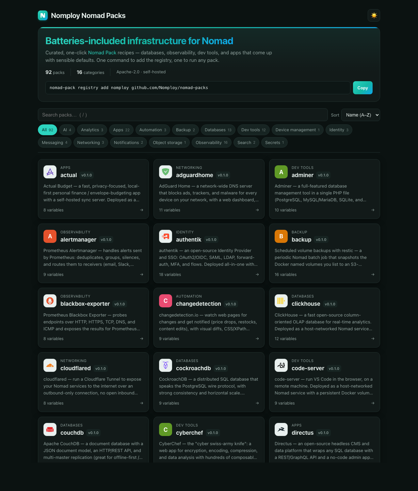

# nomploy nomad-packs

A curated [Nomad Pack](https://developer.hashicorp.com/nomad/tools/nomad-pack)
registry for [nomploy](https://github.com/Nomploy/nomploy) — one-command,
batteries-included infrastructure for a Nomad cluster.

The HashiCorp community registry doesn't carry container-registry, storage, or
observability packs, so these fill the gaps nomploy users hit.

**Browse the catalog:** https://packs.nomploy.com/ ·
**JSON API:** [`/api/packs.json`](https://packs.nomploy.com/api/packs.json)

[](https://packs.nomploy.com/)

## Use it

```bash
nomad-pack registry add nomploy github.com/Nomploy/nomad-packs
nomad-pack run zot --registry nomploy
```

In **nomploy**: create a Compose service, set the type to **Nomad Pack**, set the
pack (e.g. `zot`) and this repo as the custom registry — then Deploy.

## Packs

| Category | Packs |
|---|---|
| Databases | `postgres`, `mariadb`, `redis`, `clickhouse` |
| Object storage | `seaweedfs` |
| Messaging | `rabbitmq`, `nats` |
| Observability | `monitoring` (Prometheus + node-exporter + cAdvisor + Grafana), `loki`, `grafana` |
| Identity | `keycloak`, `vaultwarden` |
| Dev tools | `gitea`, `zot`, `adminer` |
| Automation | `n8n` |
| Analytics | `metabase` |
| Apps | `nginx`, `uptime-kuma` |
| Device management | `fleet` |

The [live catalog](https://packs.nomploy.com/) is always current — it's
generated straight from these directories.

## Layout

```
packs/<id>/
  metadata.hcl                 # name / version / description / urls
  variables.hcl                # inputs
  templates/<id>.nomad.tpl     # the job (Go template, [[ ]] delimiters, v2 parser)
  outputs.tpl                  # post-deploy hints
  README.md · CHANGELOG.md
```

## Contributing

See **[AGENTS.md](AGENTS.md)** for how to author a pack (conventions, the v2 template
syntax, volumes/ownership, all-in-one patterns).

Before opening a PR:

```bash
node scripts/lint-packs.mjs     # static format checks
scripts/validate-packs.sh       # render + `nomad job validate` each pack
```

CI runs both on every PR touching `packs/**`, and publishes the site + JSON API to GitHub
Pages on merge to `master`.

## Dependency updates

[`renovate.json`](renovate.json) configures [Renovate](https://docs.renovatebot.com) to track
the container image tags in each pack's `variables.hcl` (a custom manager matches the `*image`
variable defaults as Docker deps). It bumps version-pinned tags (e.g. `postgres:16-alpine`,
`typesense:27.1`) via PRs; images left on `:latest` aren't version-bumped. Enable the Renovate
GitHub App on the repo for it to run.

## License

Apache-2.0.
